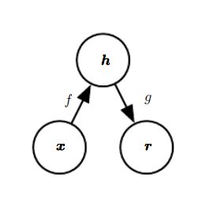
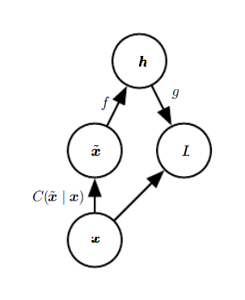

# AutoEncoder

This is a presentation of a **[PyTorch](https://pytorch.org) AutoEncoder used in the [BMS-Molecular-Translation competition](https://www.kaggle.com/c/bms-molecular-translation)**. 

Basic knowledge of PyTorch, convolutional networks is assumed.

Questions, suggestions, or corrections can be posted as issues.

I'm using `PyTorch 1.7.1` in `Python 3.8.5`.

---

# Contents

[***Objective***](https://github.com/AntoinePlissonneau/MolecularTranslationChallenge/tree/main/AutoEncoder#objective)

[***Overview***](https://github.com/AntoinePlissonneau/MolecularTranslationChallenge/tree/main/AutoEncoder#overview)

[***Implementation***](https://github.com/AntoinePlissonneau/MolecularTranslationChallenge/tree/main/AutoEncoder#implementation)

[***Training***](https://github.com/AntoinePlissonneau/MolecularTranslationChallenge/tree/main/AutoEncoder#training)

[***Inference***](https://github.com/AntoinePlissonneau/MolecularTranslationChallenge/tree/main/AutoEncoder#inference)

# Objective

**AutoEncoder is based on Unet architecture whose goal is to remove the disturbances on the images of molecules, to give color to the molecules, and to reconstruct the missing bonds.**

Here are some results generated on _test_ images not seen during training or validation:

---

---

---

---

There are more examples at the [end of the tutorial](https://github.com/AntoinePlissonneau/MolecularTranslationChallenge/tree/main/AutoEncoder#some-more-examples).

---

# Overview

In this section, we will present an overview of this model. If you're already familiar with it, you can skip straight to the [Implementation](https://github.com/AntoinePlissonneau/MolecularTranslationChallenge/tree/main/AutoEncoder#implementation) section or the commented code.

### AutoEncoders

An autoencoder is the combination of an encoder function that converts the input data into a different representation, and a decoder function that converts the new representation back into the original format. Autoencoders are trained to preserve as much information as possible when an input is run through the encoder and then the decoder, but are also trained to make the new representation have various nice properties. Different kinds of autoencoders aim to achieve different kinds of properties.

An autoencoder is a neural network that is trained to attempt to copy its input to its output. Internally, it has a hidden layer h that describes a code used to represent the input. The network may be viewed as consisting of two parts: an encoder function *h = f(x)* and a decoder that produces a reconstruction *r = g(h)*. 

If an autoencoder succeeds in simply learning to set *g(f(x)) = x* everywhere, then it is not especially useful. Instead, autoencoders are designed to be unable to learn to copy perfectly. Usually they are restricted in ways that allow them to copy only approximately, and to copy only input that resembles the training data. Because the model is forced to prioritize which aspects of the input should be copied, it often learns useful properties of the data.
Modern autoencoders have generalized the idea of an encoder and a decoder beyond deterministic functions to stochastic mappings *pencoder(h|x)* and *pdecoder(x|h)*.

  
  

    The general structure of an autoencoder, mapping an input <i>x</i> to an output (called reconstruction) <i>r</i> through an internal representation or code <i>h</i>. The autoencoder has two components: the encoder <i>f</i> (mapping <i>x</i> to <i>h</i>) and the decoder <i>g</i> (mapping <i>h</i> to <i>r</i>).
  

  <b> This section was built with: <a href="https://www.deeplearningbook.org/">Ian Goodfellow, Yoshua Bengio, and Aaron Courville (2016) <i>Deep Learning (Adaptive Computation and Machine Learning).</i> In Deep Learning Research, pages 502–503. MIT Press.</a>
  </b>

### Denoising AutoEncoders

The denoising autoencoder (DAE) is an autoencoder that receives a corrupted data point as input and is trained to predict the original, uncorrupted data point
as its output. We introduce a corruption process *C(x̃|x)* which represents a conditional distribution over corrupted samples *x̃*, given a data sample *x*. 

  
  

    The computational graph of the cost function for a denoising autoencoder, which is trained to reconstruct the clean data point <i>x</i> from its corrupted version <i>x̃</i>. This is accomplished by minimizing the loss <i>L = −log pdecoder(x|h = f(x̃))</i>, where <i>x̃</i> is a corrupted version of the data example <i>x</i>, obtained through a given corruption process <i>C(x̃|x)</i>. Typically the distribution <i>pdecoder</i> is a factorial distribution whose mean parameters are emitted by a feedforward network <i>g</i>.
  

The autoencoder then learns a reconstruction distribution *preconstruct(x|x̃)* estimated from training pairs *(x,x̃)*, as follows:
1. Sample a training example *x* from the training data.
2. Sample a corrupted version *x̃* from *C(x̃|x = x)*.
3. Use *(x,x̃)* as a training example for estimating the autoencoder reconstruction distribution *preconstruct(x|x̃) = pdecoder(x|h)* with *h* the output of encoder *f(x̃)* and *pdecoder* typically defined by a decoder *g(h)*.

Typically we can simply perform gradient-based approximate minimization (such as minibatch gradient descent) on the negative log-likelihood *−log pdecoder(x|h)*. So long as the encoder is deterministic, the denoising autoencoder is a feedforward network and may be trained with exactly the same techniques as any other feedforward network.

  <b> This section was built with: <a href="https://www.deeplearningbook.org/">Ian Goodfellow, Yoshua Bengio, and Aaron Courville (2016) <i>Deep Learning (Adaptive Computation and Machine Learning).</i> In Deep Learning Research, pages 510–512. MIT Press.</a>
  </b>

### U-Net

The main idea is to supplement a usual contracting network by successive layers, where pooling operators are replaced by upsampling operators. Hence, these layers increase the resolution of the output. In order to localize, high resolution features from the contracting path are combined with the upsampled output. A successive convolution layer can then learn to assemble a more precise output based on this information. One important modification in this architecture is that the upsampling part has also a large number of feature channels, which allow the network to propagate context information to higher resolution layers. As a consequence, the expansive path is more or less symmetric to the contracting path, and yields a u-shaped architecture. The network does not have any fully connected layers and only uses the valid part of each convolution, i.e., the segmentation map only contains the pixels, for which the full context is available in the input image.

  
  

    U-net architecture (example for 32x32 pixels in the lowest resolution). Each blue box corresponds to a multi-channel feature map. The number of channels is denoted on top of the box. The x-y-size is provided at the lower left edge of the box. White boxes represent copied feature maps. The arrows denote the different operations.
  

  <b> This section was built with: <a href="https://arxiv.org/abs/1505.04597">Olaf Ronneberger, Philipp Fischer, and Thomas Bro (2015) <i>U-Net: Convolutional Networks for Biomedical Image Segmentation</i>, Computer Science Department and BIOSS Centre for Biological Signalling Studies, University of Freiburg, Germany, arXiv:1505.04597. [cs.CV]</a>
  </b>

# Implementation

The sections below briefly describe the implementation.

# Training

# Inference

### Some more examples

---

---

---

---

